# Voynich Cataloging Tool — Manual

*Written 2026-08-17, against commit `09a4de1`. The app is under active
development — if something here doesn't match what's on screen, the code
is the tie-breaker, not this document.*

**Contents:** [What this is](#what-this-is) ·
[Install & first run](#install--first-run) ·
[The main window](#the-main-window) ·
[Cataloging basics](#cataloging-basics) ·
[Content-area regions](#content-area-regions) ·
[Color analysis tools](#color-analysis-tools) ·
[Vision queries](#vision-queries) ·
[Multi-page views](#multi-page-views) ·
[Rapid review mode](#rapid-review-mode) ·
[Data & backups](#data--backups) ·
[CLI reference](#cli-reference) ·
[Known limitations](#known-limitations) ·
[Appendix: how this manual got made](#appendix-how-this-manual-got-made)

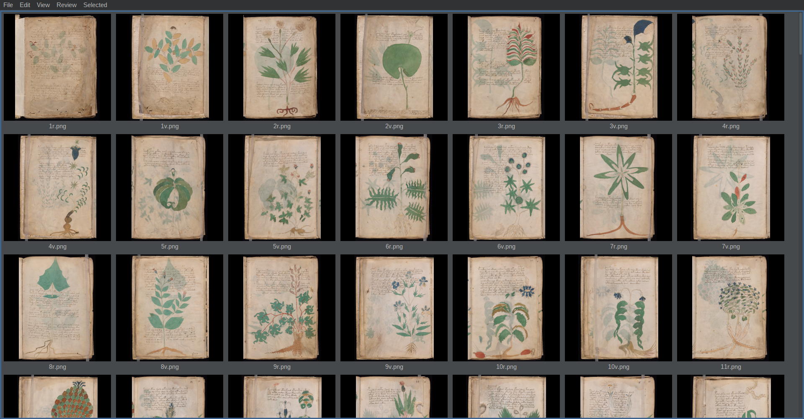

*The main window after an initial scan, sorted by folio number
(View → Sort → Page number): 1r, 1v, 2r, 2v… in the manuscript's own
page order.*

## What this is

This is a cataloging and annotation tool for a scanned image corpus of the
Voynich manuscript — it doesn't attempt to read or decode the text. It
exists to support close visual research work: browsing the full scan set,
tracing the actual content area of a page by hand (excluding vellum
margins, photography backdrop, and other pages visible through the stack),
running quantitative colour analysis (frequency histograms, ΔE difference
maps) over a page or a traced region, keeping free-form notes and tags per
folio, and — optionally — asking a local vision-language model free-text
questions about a page or region.

Nothing here is automated inference about the manuscript's content. Region
tracing is deliberately human-only (see [Content-area regions](#content-area-regions)
below); the tool's job is to make that kind of close, repeatable visual
work faster to do and easier to keep organized across ~200+ scans, not to
replace the researcher's own judgment.

---

## Install & first run

Requires Java 17 and Maven. From the repo root:

```bash
mvn package
java -jar target/Voynich-1.0-jar-with-dependencies.jar
```

On first launch the app creates `~/.infVoy/` if it doesn't exist yet. If
`~/.infVoy/config.json` is missing, or missing its `scanPath` key, the app
writes a template config to stderr and exits (code 2) instead of guessing.
Create the file yourself, pointing `scanPath` at a local directory of PNG
scans:

```json
{
  "scanPath": "/path/to/your/scans"
}
```

A different config file can be passed as the first command-line argument,
if you want to keep more than one catalog (e.g. separate scan sets).

The catalog itself — one record per scanned file, thumbnail included — is
stored under `~/.infVoy/catalog/`, independent of where the scans
themselves live on disk. The first time you point the app at a scan
directory, the catalog is empty: use **File → Scan** to walk `scanPath`
and populate it. Re-running Scan later is safe — it records a "sighting"
per file rather than duplicating entries, so it's the normal way to pick
up new scans added to the directory afterward.

**A note on first-run ordering:** the initial Scan populates the catalog
via a parallel, multithreaded walk of `scanPath`, so entries land in
whatever order the scan threads happened to finish — not filesystem order,
not alphabetical, not folio order. On a brand-new catalog the thumbnail
grid will look shuffled until you pick a real sort. **View → Sort → Page
number** gives true folio order (numeric on the leading page number, recto
before verso for the same number) and is the one worth setting first.
Non-foliated files — covers, flyleaves, anything whose filename doesn't
start with a digit-plus-r/v — have no folio number to sort by, so this
sort always places them last as a group, in plain alphabetical order among
themselves. The sort choice persists to your config, so this is a
one-time step, not something you repeat every session.

## The main window

The main window is a single scrollable grid of thumbnails — one per
catalogued scan — with a menu bar across the top. There's no toolbar; every
action lives in the menu bar, in a conventional CUA layout:

- **File** — Scan (populate/refresh the catalog from `scanPath`), Storage…
  (checkpoints, see [Data & backups](#data--backups)), Exit.
- **Edit** — Select All, Clear Selection.
- **View** — Sort (by filename or folio/page number, ascending or
  descending — see the note on first-run ordering above), Filter (prompts
  for free text and an optional "invert" checkbox, then narrows the grid
  to entries whose whole JSON record does — or, inverted, does *not* —
  contain that text case-insensitively; blank text clears the filter),
  and a "Content Area Only" toggle that, where a page has a traced
  content region, crops thumbnails and views to it rather than showing
  the full scan.
- **Review** — MarkUp…, which starts a rapid, shuffled pass over the whole
  catalog for quick tagging (see [Rapid review mode](#rapid-review-mode)).
- **Selected** — every action that operates on one or more highlighted
  thumbnails: Color Frequency, ΔE Heatmap, Ask Vision…, Open in infimg,
  Two-Page View, Thumbnail Matrix. Which of these are enabled depends on
  how many thumbnails are selected — Color Frequency and ΔE Heatmap need
  exactly one; Ask Vision and Open in infimg work with one or more; Two-Page
  View only appears usable when the current selection is a valid recto/verso
  pair; Thumbnail Matrix works with one or more.

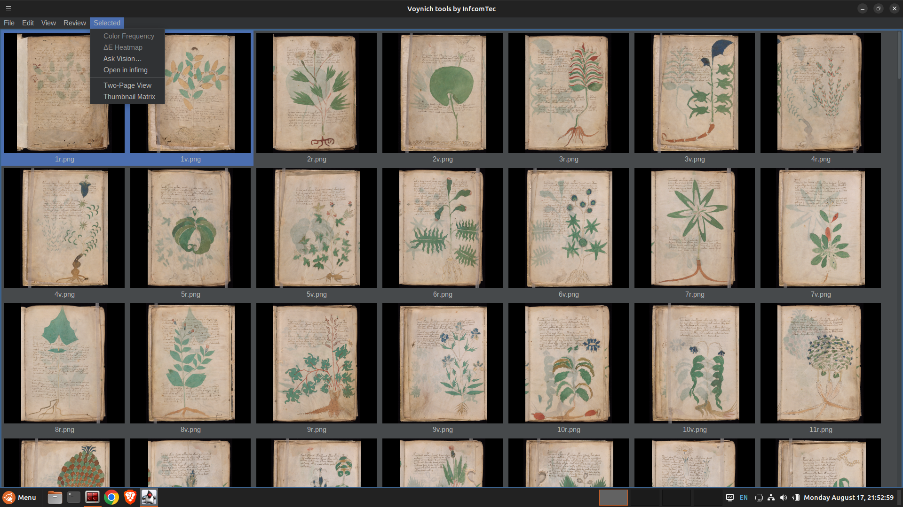

*The Selected menu with two thumbnails picked: Color Frequency and ΔE
Heatmap are greyed out because those two need exactly one selection; the
rest work with two or more.*

Selecting thumbnails follows ordinary file-manager conventions: click to
select one (replacing the prior selection), Ctrl-click to toggle one
thumbnail in or out of the selection, Shift-click to select a contiguous
range. A double-click opens that page in the entry editor (see
[Cataloging basics](#cataloging-basics)) — if the entry wasn't already part
of the selection, double-clicking collapses the selection down to just that
one entry first.

A busy indicator — a small animated LED scanner bar, not a spinning wait
cursor — sits at the trailing end of the menu bar and lights up whenever a
background task (a scan, a color analysis render, a vision query, an image
decode) is running.

## Cataloging basics

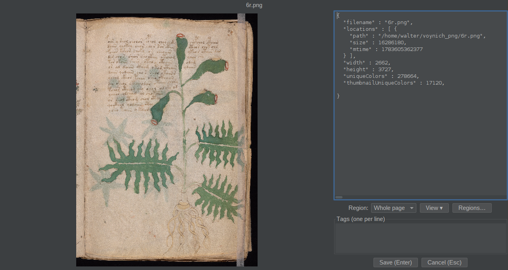

Double-clicking a thumbnail opens the entry editor: the full-resolution
image on one side, a raw-JSON view of the catalog record, and a free-text
tags box. The editor is non-modal, so you can have several open at once
alongside the main window — it doesn't try to limit how many tool windows
you're allowed.

Each catalog entry is keyed by **filename**, not by filesystem path — the
same scan sometimes exists at more than one location (e.g. a network copy
and a faster local copy), and both collapse into one entry rather than
producing duplicates.

Two free-form fields exist per entry, deliberately unstructured rather
than drawn from a fixed category list, since the kinds of observation
worth noting keep changing as the work goes:

- **`torrentJpg`** — a cross-reference to the original 2004 torrent
  release's JPG numbering, for anyone correlating this catalog against
  that older, differently-numbered distribution.
- **Tags** — short free-text notes, one entry can carry several. Add one
  from the tags box in the entry editor.

## Content-area regions

A **region** is a hand-traced polygon over one scan, marking a specific
area of interest. Every entry automatically gets one synthetic region — a
rectangle spanning the whole image — the moment its dimensions are known;
that one is never user-editable.

The one region that matters most is the **main content area** (region
index 1, if present): a tight polygon around the page's actual content —
text and illustration — that deliberately *excludes* blank vellum margins,
the black photography backdrop, and other pages of the stack visible
underneath. This is a judgment call the researcher makes per page, not
something the software infers: whether a faint mark counts as content, and
what to do about a fold that content clearly runs across, are decisions
left entirely to the human doing the tracing. There's no auto-detection
here on purpose — see the in-code rationale for why an automated boundary
would be actively wrong more often than a traced one.

Beyond the main content area, any further region (index 2 and up) is an
"other area" — damage, a second reviewer's opinion, an inset detail,
whatever else turns up — distinguished only by a free-text `kind` and
`author`, not a fixed category enum. That `author` field (blank means
literally unattributed, never implicitly "you") is the one piece of the
data model that already anticipates more than one person tracing regions
— it's just not connected to anything yet: nothing in the UI filters,
displays, or merges by it, and tags have no equivalent field at all. See
[Known limitations](#known-limitations) for where the multi-person story
actually stands.

A region can also have **child regions** — a smaller figure nested inside
a larger traced diagram, for instance — via each row's **Add Child**
button, which zooms the tracing canvas to the parent's bounding box before
you trace the child. A child's `kind`/`author` prompt currently starts
blank rather than inheriting the parent's `author`, even though it was
just traced inside that parent's boundary — worth knowing if you're
tracing a family of nested regions and expect the author to carry down
automatically; right now it doesn't, and you'll want to fill it in by
hand each time.

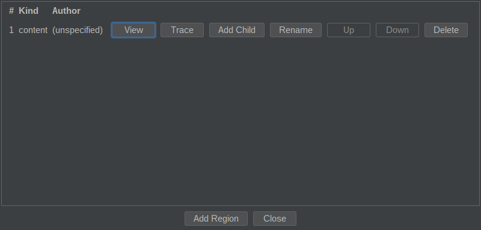

*10r's real traced "content" region — the botanical illustration plus its
script block, isolated from the vellum margins and photography backdrop.*

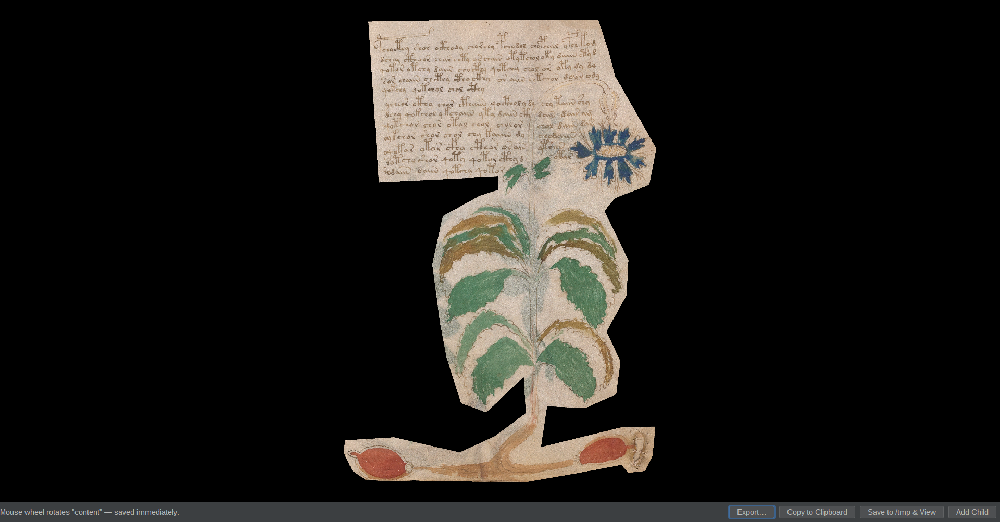

*The same region as actually seen through it, via Regions… → View — a
crop-to-polygon render, black outside the traced boundary.*

**Tracing a region:** open an entry, click **Regions…** to open the region
manager (list of existing regions with View/Trace/Rename/Up/Down/Delete,
plus an Add button), then Trace opens the tracing canvas: click to place
polygon vertices tightly around the actual content, click near the start
point to close it, drag any vertex afterward to adjust. A pair of loupes
(a plain 4× and a contrast-boosted 4×) follow the cursor to catch both
imprecise placement and faint content that's easy to miss at normal zoom.
Every region-manager action saves immediately — there's no separate "Done"
step to remember.

Once a main content area exists for a page, **View → Content Area Only**
crops the thumbnail and other views down to it, and `CatalogCli`'s
`--content-area` flag (see [CLI reference](#cli-reference)) does the same
for scripted extraction.

## Color analysis tools

Select exactly one entry and use **Selected → Color Frequency** or
**Selected → ΔE Heatmap** (also reachable from an open entry editor's
"View ▾" menu). Both work on colour converted to CIELAB, not raw RGB —
CIELAB distance tracks *perceived* colour difference far more faithfully
than RGB distance does, which matters when the goal is spotting a real
pigment or staining anomaly rather than a JPEG-compression artifact.

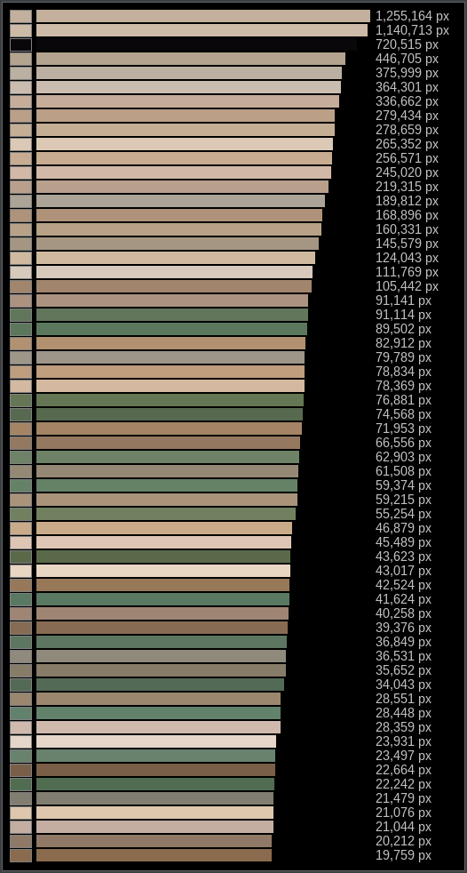

**Color Frequency** ranks every colour that appears on the page (or in the
selected region) by pixel count, as horizontal swatch bars. Colours are
grouped into ~5-unit CIELAB bins before ranking, not compared by exact RGB
value — these scans are shot against a flat black backdrop, which repeats
a handful of exact RGB values enormous numbers of times, while the paper's
natural grain (though it covers far more of the page) splits its true
colour across thousands of individually small, near-identical values.
Ranking by exact RGB would bury the paper and ink entirely under backdrop
noise; the CIELAB binning is what makes the chart actually about the page
content.

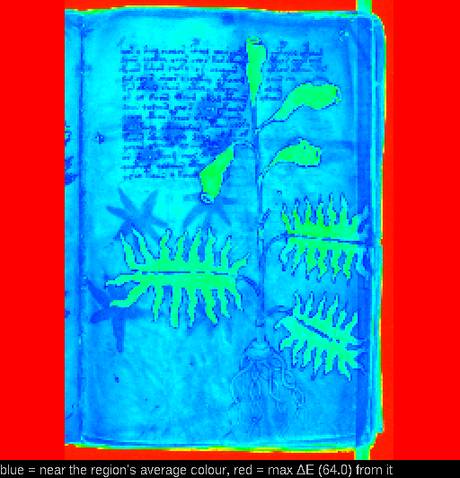

**ΔE Heatmap** renders a per-cell colour distance (CIE76 ΔE) from the
page's pixel-count-weighted mean colour, blue where a cell is close to
that mean and red where it's most different — a spatial view of where ink,
staining, or pigment stands out, rather than just a ranked list. When
viewing a traced region rather than the whole page, cells outside the
polygon render as plain black and are excluded from the scale entirely,
so a bounding-box crop's masked-out corners don't wreck the reference mean
or crush real in-region variation down near invisible.

## Vision queries

**Selected → Ask Vision…** sends the selected page (or region, or a
composite of two selected pages) to a local vision-language model
(gemma-4-e4b, served via llama.cpp) along with a free-text question you
type, and shows the model's answer in a dialog.

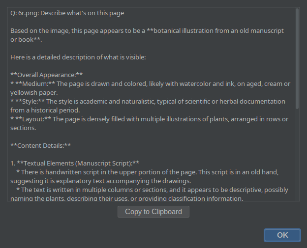

This runs entirely against a self-hosted model, not a cloud API — the
image never leaves your own network. It's a useful first pass for a quick
"what's roughly on this page" description, but treat it as a fast
first-look tool, not a source of ground truth: this
project's own testing against the full 213-scan corpus found the model
producing confident, detailed, and simply *wrong* justifications on close
calls, and reliably missing small figures crowded into a text-heavy page's
margins. Small, low-contrast detail is also the first thing lost —
uploads are downscaled before the model sees them (2048px on the longer
side; the model itself has a lower effective floor than that), which is
fine for "this page has a large plant illustration" and unreliable for
"is this faint mark blue or green." Treat every answer as a lead to verify
against the actual scan, not a citation.

**Selection count changes the shape of the call:**

- **One page** — one call, whole page or the selected region.
- **Two pages** — you're offered a choice: *Combined* (the two images
  composited into one side-by-side image, one vision call over both) or
  *Separate* (two independent calls).
- **Three or more** — after a single confirmation ("N images / N calls"),
  one call per image, fired sequentially, never concurrently — the vision
  backend isn't meant to see simultaneous requests.

## Multi-page views

Two selection-scoped composite views, both built at full resolution and
opened through **infimg** (a separate companion image-viewer tool, must be
installed and configured via `infimgJar` in `config.json`) rather than a
one-off in-app dialog — so the result can be saved, copied, or discarded
using infimg's own tools.

**infimg doesn't come with this repo** — it's a sibling project you build
separately. If `Selected → Open in infimg`, Two-Page View, or Thumbnail
Matrix fail with a launch error, that's almost certainly why. To set it
up: clone and `mvn package` the infimg repo, write a tiny wrapper script
that runs its fat jar (e.g. `~/bin/infimg` containing `exec java -jar
/path/to/infimg-*-jar-with-dependencies.jar "$@"`), then point
`"infimgJar"` in `~/.infVoy/config.json` at that wrapper script's path —
not the jar directly. The indirection through a wrapper script is
deliberate: it means a future infimg version bump doesn't require editing
this config again. Note that the app itself can install and build cleanly
while `infimgJar` is still unset — every infimg-backed menu item then
just has nothing to launch, with no error until you try one.

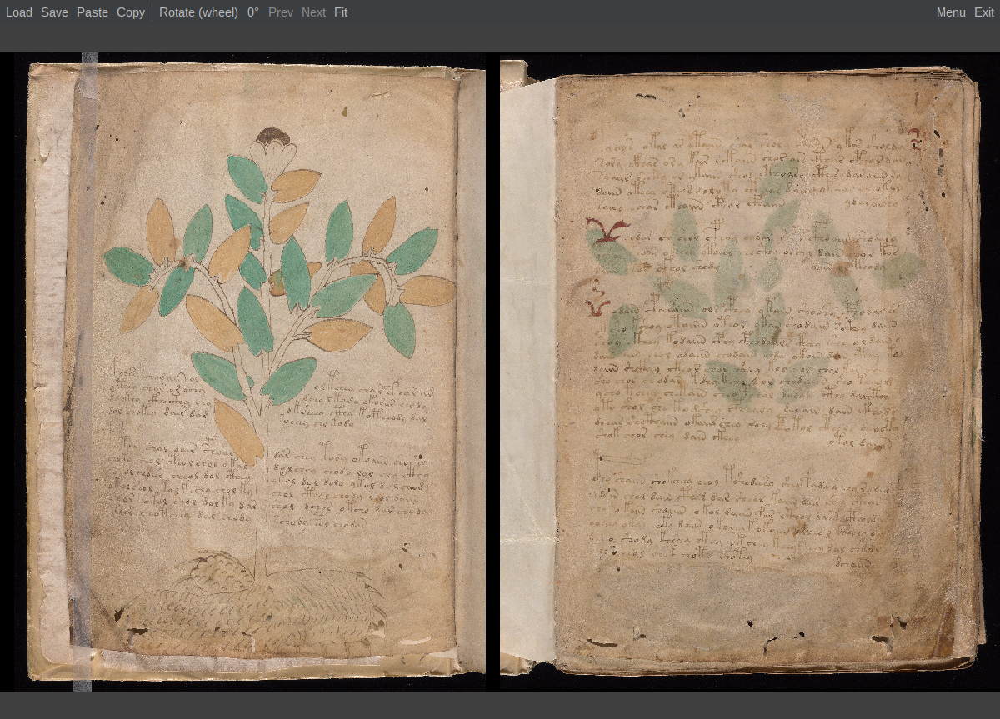

**Two-Page View** — select a recto and its matching verso (e.g. `1r` and
`1v`) and choose **Selected → Two-Page View**. The composite always places
verso on the left and recto on the right, matching how an open book spread
actually reads: the verso is the back of the *previous* leaf, the recto
the front of the *current* one. Only appears usable when the current
selection resolves to a genuine recto/verso pair by filename — a
non-foliated page (a cover, a flyleaf) or an irregular filename has no
inferable counterpart, by design.

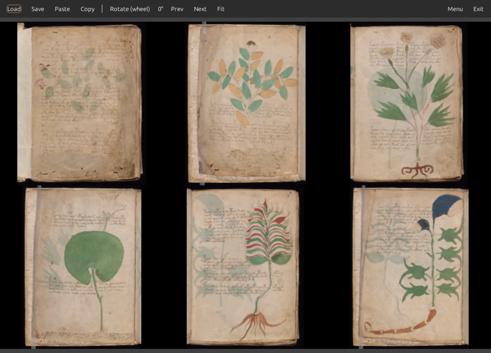

**Thumbnail Matrix** — select any number of entries and choose **Selected
→ Thumbnail Matrix** to composite their thumbnails into one square-ish
grid image, handy for an at-a-glance comparison across several pages at
once (a whole quire, a set of pages sharing a suspected illustrator's
hand, etc.). Above 12 selected files the GUI nags with a screen-fit
warning before building the composite.

## Rapid review mode

**Review → MarkUp…** starts a shuffled, whole-catalog pass through the
entry editor, meant for quickly tagging many pages against a single
judgment call (e.g. "does this page show visible wash/staining?") without
opening and closing each entry by hand. Click a point on the image to
stage a tag built from where you clicked; nothing is written to the
catalog until you click Done, so a review pass can be abandoned cleanly.
The dialog itself has no built-in notion of what any particular tag
means — the judgment (what counts as "wash," what template to build from a
click point) is supplied by whichever review action you launch, so the
same rapid-click mechanism can be reused for a different kind of pass
later.

## Data & backups

Config, catalog, and checkpoints all live under one base directory,
`~/.infVoy/`:

- `~/.infVoy/config.json` — your settings (see [Install & first run](#install--first-run)).
- `~/.infVoy/catalog/` — one JSON file per catalogued scan, thumbnail
  included inline as base64, so the catalog is portable as a plain
  directory of files.
- `~/.infVoy/catalog-checkpoints/` — manual whole-catalog snapshots.

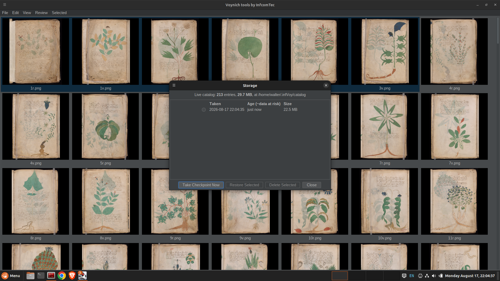

**File → Storage…** opens a dialog listing every checkpoint you've taken,
each with its timestamp, age, and size, and lets you take a new one,
restore the most recent one, or delete old ones. A checkpoint is a full
zip of the entire catalog at that moment — restoring replaces the whole
catalog with that snapshot, discarding anything written since. It's a
full replace, not a merge: there's no partial undo of a single entry's
edit, only "go back to how everything looked at checkpoint time." Old
checkpoints are never pruned automatically, so cleaning them up (or not)
is entirely up to you via that same dialog.

Take a checkpoint before any large batch operation — a rapid-review pass
over the whole catalog, a bulk region-tracing session — the same way
you'd commit before a risky refactor.

### Sharing a catalog with someone else

The catalog directory
(`~/.infVoy/catalog/`) is just plain JSON files — genuinely portable, copy
it anywhere, sync it with `rsync`, hand it to a collaborator on a USB
stick. Point their `scanPath` at their own copy of the scans (filenames
have to match — the catalog is keyed by filename, not by any shared ID)
and their `~/.infVoy/catalog/` at your copied-over directory, and they'll
see everything: your tags, your traced regions, your notes.

What doesn't exist yet is a **merge tool** — or even a settled design for
one. If two people trace regions or add tags independently, there's
currently no diff/merge path, only "wholesale replace one catalog with
the other." That's not just an unimplemented feature; there's literally
no community of co-editors yet to design it *against*. How region tracing
is actually done is itself personal technique — order, precision, what
counts as a boundary worth drawing — not a single documented procedure
(see [Content-area regions](#content-area-regions)), so two people's
traces of the same page are two independent judgments, not two attempts
at the same measurement. A real merge tool would need to decide what
"reconciling" even means for that kind of data — keep both as separate
regions? Flag disagreement for a human to resolve? Something else? — and
that's a question this project hasn't had reason to answer yet, because
it's been one person's working catalog so far. If you're the second
person to pick this catalog up: for now, coordinate who "owns" the
working copy at any given moment rather than editing two copies in
parallel and hoping to reconcile them later.

## CLI reference

Everything the GUI can do to the catalog also has a command-line
equivalent, useful for scripting, batch extraction, or quick lookups
without opening the app. Run via:

```bash
java -cp target/Voynich-1.0-jar-with-dependencies.jar nl.infcomtec.voynich.CatalogCli <command>
```

Key commands:

- **`list [filter]`** — list catalog entries; an optional case-insensitive,
  invertible text filter matches over an entry's whole JSON.
- **`get <filename>`** / **`tag <filename> <tag>`** / **`save`** — inspect
  or edit a single entry's record.
- **`extract`** — pull real decoded pixels. `--pixel x,y` and
  `--region x,y,w,h` (both repeatable) return RGB/Lab/hex colour values,
  the same colour math the GUI's analysis views use. `--content-area`
  writes a PNG cropped to the entry's main content region instead, black
  outside the polygon.
- **`vision <filename> [<filename>...] <question...>`** — ask the local
  vision model a free-text question, same underlying call as the GUI's Ask
  Vision. Supports `--content-area`/`--region-name <kind>` to scope the
  question to a traced region, and `--combine` to composite two whole-page
  images side by side and ask once. A single filename needs no separator;
  two or more require a literal `--` before the question.
- **`two-page <filename> [<other-filename>]`** / **`matrix <filename>
  [<filename>...]`** — CLI equivalents of Two-Page View and Thumbnail
  Matrix; `--out <path>` writes the composite to a file instead of opening
  it via infimg.
- **`checkpoint`** / **`restore`** — CLI equivalents of the Storage dialog's
  take/restore actions.

See `scripts/test-catalog-cli.sh` in the repo for a working example of
every command's argument shape.

## Known limitations

A single honest list, gathering what's mentioned individually elsewhere
in this manual plus a couple of things that only show up in practice:

- **No catalog merge tool, and no settled design for one either.** Two
  people's independently-traced regions or tags can't be combined — see
  [Sharing a catalog with someone else](#sharing-a-catalog-with-someone-else).
  This isn't just unimplemented: there's no community of co-editors yet
  to design a merge model against, and tracing is personal technique, not
  a single documented procedure, so it isn't obvious what "reconciling"
  two people's traces of the same page should even mean. Only one person
  should be the working copy's "owner" at a time, for now. There is one
  small seed already in the data model for this — each region carries a
  free-text `author` field (see [Content-area regions](#content-area-regions))
  — but it's not wired to anything: no UI shows it, filters by it, or uses
  it to resolve a conflict, and tags have no equivalent field at all. Even
  where `author` exists, it isn't propagated automatically — a child
  region traced inside a parent's boundary via Add Child doesn't inherit
  the parent's `author`, despite the nesting implying the same person
  likely traced both.
- **Vision answers aren't ground truth.** The local vision model
  confabulates confidently-wrong justifications on close calls and misses
  small figures crowded into busy pages — see [Vision
  queries](#vision-queries). Treat every answer as a lead to verify, not
  a citation.
- **Two-Page View needs a real recto/verso pair.** Non-foliated pages
  (covers, flyleaves) and irregular filenames (a multi-folio composite
  scan, say) have no inferable counterpart and can't use it, by design —
  see [Multi-page views](#multi-page-views).
- **infimg is a separate install**, not bundled with this repo — Two-Page
  View, Thumbnail Matrix, and Open in infimg all depend on it being built
  and configured correctly first. See the note in [Multi-page
  views](#multi-page-views) if those menu items silently do nothing.
- **Content-area tracing is entirely manual, on purpose** — there's no
  auto-detection, and no plan to add one. See [Content-area
  regions](#content-area-regions) for why an automated boundary would be
  actively wrong more often than a traced one is right.
- **Checkpoint restore is all-or-nothing.** There's no way to undo a
  single entry's edit in isolation — only "replace the whole catalog with
  an earlier snapshot." See [Data & backups](#data--backups).
- **No automated tests.** This is a two-person project with a tight
  manual-verification loop rather than a test suite — a deliberate choice
  for its scale, not an oversight, but worth knowing if you're expecting
  CI coverage before trusting a change.
- **This manual only shows tracing's before/after, not the act itself**
  ([Content-area regions](#content-area-regions)) — deliberately. A
  screenshot or even a video would show *one person's* click order, pace,
  and precision, which risks reading as "the correct way to trace" when
  it isn't. How carefully you trace, in what order, how much you fuss
  over a faint mark, is genuinely personal judgment (see the same
  section) — there's no canonical technique to demonstrate.

## Appendix: how this manual got made

Screenshots were taken on a second machine, with the scan corpus and
catalog synced over per [Sharing a catalog with someone
else](#sharing-a-catalog-with-someone-else) above. The screenshot-taking
was delegated to a second Claude Code instance running on that machine,
coordinated with the instance writing this document via Anthropic's
[Remote Control](https://code.claude.com/docs/en/remote-control) /
cross-session messaging — two Claude sessions on separate machines
exchanging tasks and results directly, no human relaying messages by
hand. Screen-driving via `xdotool` against a live desktop session was the
slow part of the process; the messaging itself was reliable once both
sides had Remote Control enabled.
