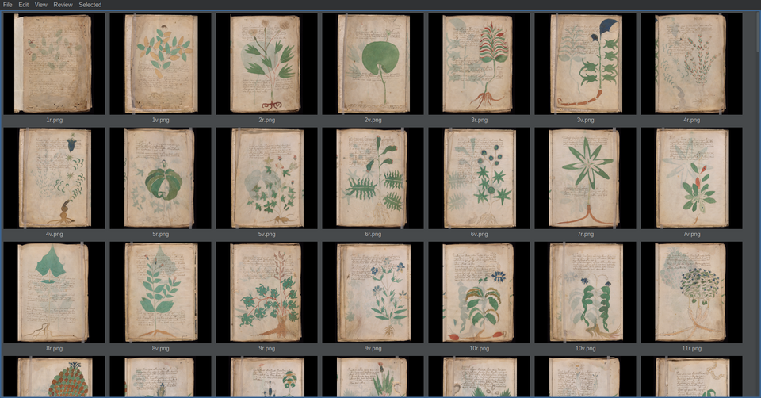

# Voynich

> **Disclaimer:** AI was used extensively as grunt labor for text processing
> in this project. No unsupervised AI code should be present.

*What the main window looks like once populated — not what you'll see on
first launch. On a fresh install the catalog starts empty; run File → Scan
against your own scan folder first. See [Install & first
run](MANUAL.md#install--first-run).*

A cataloging and close-visual-analysis tool for the Voynich manuscript's
scanned pages — it doesn't attempt to read or decode the text. Browse the
full scan set, hand-trace the actual content area of a page (excluding
vellum margins, photography backdrop, and other pages visible through the
stack), run quantitative colour analysis (CIELAB frequency histograms, ΔE
difference maps) over a page or a traced region to spot real pigment or
staining anomalies, keep free-form notes and tags per folio, and —
optionally — ask a local vision-language model free-text questions about
a page or region. Nothing here is automated inference about the
manuscript's content: region tracing is deliberately human-only, and the
tool's job is to make that kind of close, repeatable visual work faster
and better organized across ~200+ scans, not to replace the researcher's
own judgment.

Under the hood it's a general-purpose large-image-collection cataloger —
nothing in the codebase assumes manuscript content, so the same
scan-decode-catalog-and-annotate machinery applies just as well to, say, a
drone survey of power pylons or a photo-documented equipment failure
report. Think Lightroom, but for a research corpus instead of a photo
library. The Voynich manuscript scans just happen to be the dataset that
motivated it.

## Getting started

- **First time setting this up, or never installed a Java tool before?**
  → [INSTALL.md](INSTALL.md) — starts from zero: getting Java, getting the
  scans (and converting them to the format this app wants), and setting
  up the companion viewer, [infimg](https://github.com/Walter-Stroebel/infimg),
  that several core menu actions depend on.
- **Already have Java installed and just want the app itself?** → grab
  the latest release jar from [the Releases
  page](https://github.com/Walter-Stroebel/Voynich/releases/latest), no
  build tools needed — see [INSTALL.md](INSTALL.md#2-download-the-app-itself)
  onward for the scans/infimg/config steps that come after.
- **Building from source instead** (Maven/git, modifying the code) →
  [MANUAL.md](MANUAL.md#install--first-run) or [INSTALL.md's source-build
  appendix](INSTALL.md#building-from-source-instead)
- **Using the app** — cataloging, region tracing, colour analysis, vision
  queries, multi-page views, CLI — → [MANUAL.md](MANUAL.md)
- **Architecture, class-by-class rundown, build details** → [CLAUDE.md](CLAUDE.md)
- **Which scan source to use, and the still-open page-naming question**
  → [SCANS.md](SCANS.md)
- **The id-canonical naming-scheme database — closing a real gap in tying
  the manuscript's competing naming schemes to one shared identity** →
  [DATABASE.md](DATABASE.md)

## Current state

Early. Cataloging, thumbnailing, per-image colour analysis, region tracing,
and local vision-model queries are implemented and in daily use. Similarity
search / duplicate detection across the whole collection — the original
motivating feature — hasn't been built yet; see [CLAUDE.md](CLAUDE.md) for
the full state and roadmap.

## Why plain files, not a DB

The catalog started on MySQL, on the reasoning that anyone running their
own container already has the "which DB, where, why, how" answers a
single-user desktop tool shouldn't pre-decide for them. Retired once
inlined base64 thumbnails and single-zip checkpoints made a second
stateful service stop paying for itself — see [CLAUDE.md](CLAUDE.md) for
the mechanics. `replication/` is unrelated and remains as generic MySQL
replication work unconnected to the catalog.
